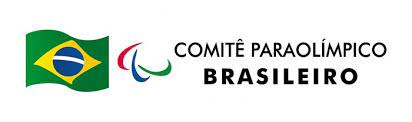
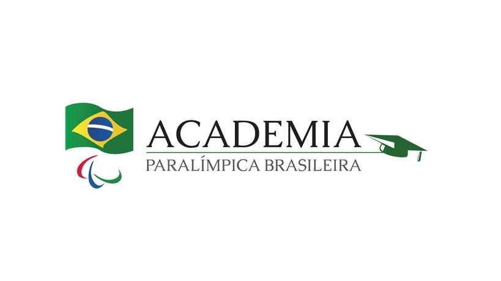

<!--install and/or load all R packages-->
```{r setup, include = FALSE, echo = FALSE, warning = FALSE, message = FALSE, fig.align = 'center', out.width = "100%", results = "hide"}
knitr::opts_chunk$set(
  echo = FALSE,
  warning = FALSE,
  message = FALSE,
  fig.align = 'center',
  results = "asis",
  include = TRUE,
  out.width = "100%",
  knitr.kable.NA = '--',
  knitr.table.format = "html"
)
```

```{r nojekyll, results = "hide"}
if(!file.exists(".nojekyll")) {
  file.create('.nojekyll')
}
```

<br>

<center>

```{r logo-ies}
if(file.exists("2025/Logo_Paradesportivo_2025.jpg")) {
  cat('')
}
```

</center>

<br>

<hr style="height:2px;border-width:0;color:#2C3E50;background-color:#2C3E50">

<a style="float:right" href="#top"><b>Início `r library(fontawesome); fa("circle-up")`</b></a>

# **O Simpósio**

<br>

## **Tema**

### *Em breve*

<br>

## **Data**

### *17 de setembro de 2025*

<br>

## **Inscrições**

### [`r library(fontawesome); fa("arrow-up-right-from-square", margin_right = "0.1em")`](https://forms.gle/SzQQ3AiAtDD2ndwYA) *Gratuitas*

<br>

## **Local**

### [`r library(fontawesome); fa("location-dot", margin_right = "0.1em")`](local.html) *Av. Paris 84, Bonsucesso, RJ - Auditório Sylvia Bisaggio*

<br>

<hr style="height:2px;border-width:0;color:#2C3E50;background-color:#2C3E50">

<a style="float:right" href="#top"><b>Início `r library(fontawesome); fa("circle-up")`</b></a>

# **Sobre o evento**

O Simpósio Paradesportivo Carioca tem como objetivo apresentar e discutir questões relacionadas à prática de esportes por pessoas com deficiência entre estudantes de graduação e pós-graduação, profissionais e pesquisadores nas diferentes áreas de conhecimento.

<br>

O Simpósio Paradesportivo Carioca é um evento realizado pelo Programa de Pós- graduação em Ciências da Reabilitação (PPGCR) da UNISUAM, como uma das ações da linha de pesquisa “Reabilitação no esporte e no esporte adaptado”. O evento conta com o apoio da Academia Paralímpica Brasileira (APB), entidade científica do Comitê Paralímpico Brasileiro (CPB).

<br>

Em todas as edições (2015, 2016, 2017, 2019, 2021, 2022, 2023 e 2024), além das palestras, mesas redondas, mini-cursos e lançamento de livros, os participantes internos e externos tiveram a oportunidade de apresentar trabalhos científicos (incluindo TCCs, dissertações de mestrado e teses de doutorado) em forma de pôster, com premiação dos melhores trabalhos. Ao longo desses anos, o Simpósio Paradesportivo Carioca se tornou um evento de referência na área do Esporte para Pessoas com Deficiência, com a participação de mais de 1000 pessoas.

<br>

A realização do Simpósio Paradesportivo Carioca é uma forma de aumentar a visibilidade do PPGCR/UNISUAM por meio da divulgação das pesquisas, estimulando o ingresso de novos discentes e parcerias interinstitucionais. Além disso, a realização de eventos é um dos critérios da CAPES para a avaliação dos PPG, contribuindo para a melhor avaliação do PPGCR/UNISUAM na Área 21.

<br>

<hr style="height:2px;border-width:0;color:#2C3E50;background-color:#2C3E50">

<a style="float:right" href="#top"><b>Início `r library(fontawesome); fa("circle-up")`</b></a>

#  **Comissão Organizadora**

- Profa. Dra. Patrícia dos Santos Vigário (UNISUAM)
- Profa. MSc. Júlia Lemos (UNISUAM)
- Prof. Carlos Alberto Cordella (UNISUAM)
- Prof. Mateus Miccichelli (UNISUAM)
- Prof. Aroldo Caio de Araújo Barros (UNISUAM)

<br>

<hr style="height:2px;border-width:0;color:#2C3E50;background-color:#2C3E50">

<a style="float:right" href="#top"><b>Início `r library(fontawesome); fa("circle-up")`</b></a>

# **Comissão Científica**

- Prof. Dr. Agnaldo José Lopes (UNISUAM)
- Profa. Dra. Angela Nogueira Neves (EsEFEx)
- Prof. Dr. Arthur de Sá Ferreira (UNISUAM)
- Prof. Dr. Conrado Torres Laett (UNISUAM)
- Prof. Dr. Diego Viana (UFRJ)
- Prof. Dr. Estevão Rios Monteiro (UNISUAM)
- Prof. Dr. Fábio Vieira dos Anjos (UNISUAM)
- Prof. Dr. Igor Ramathur Telles de Jesus (UNISUAM)
- Prof. Dr. Juliana Valentim BIttecourt (UNISUAM)
- Prof. Ms. Júlia Lemos (UNISUAM)
- Profa. Dra. Laura Alice Santos Oliveira (UNISUAM)
- Prof. Dr. Leandro Alberto Calazans Nogueira (UNISUAM)
- Profa. Dra. Luciana Crepaldi Lunkes (UNISUAM)
- Prof. Dr. Luis Felipe da Fonseca Reis (UNISUAM)
- Profa. Dra. Míriam Raquel Meira Mainenti (EsEFEx)
- Prof. Dr. Ney Armando de Mello Meziat Filho (UNISUAM)
- Prof. Dr. Rafael Mocarzel (Univassouras)
- Prof. Dr. Renato Santos de Almeida (UNISUAM)
- Prof. Dr. Thiago Lemos de Carvalho (UNISUAM)

<br>

<hr style="height:2px;border-width:0;color:#2C3E50;background-color:#2C3E50">

<a style="float:right" href="#top"><b>Início `r library(fontawesome); fa("circle-up")`</b></a>

# **Apoio**

<!--FUNDING AGENCIES BADGES-->
<table class="table" style="background-color:white">
  <tr>
    <td width="20%" style='vertical-align: middle; text-align: center;'>
      <a href="https://cpb.org.br"></a>
      </td>
    <td width="20%" style='vertical-align: middle; text-align: center;'>
      <a href="https://cpb.org.br/ciencia-e-pesquisa/academia-paralimpica/"></a> 
      </td>
  </tr>
</table>

<br>

<a style="float:right" href="#top"><b>Início `r library(fontawesome); fa("circle-up")`</b></a>

<br>
